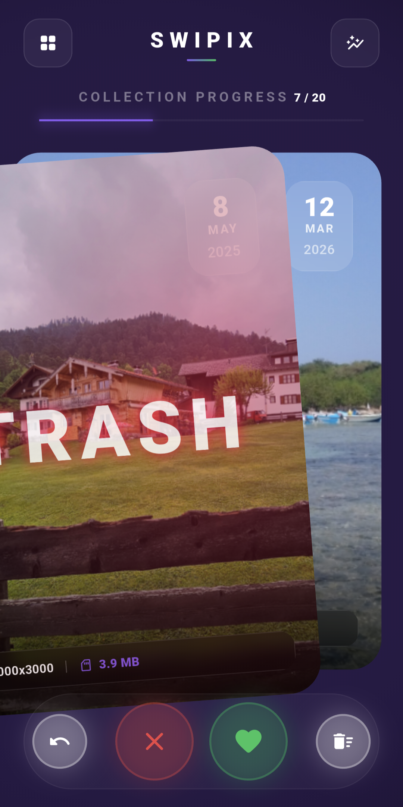
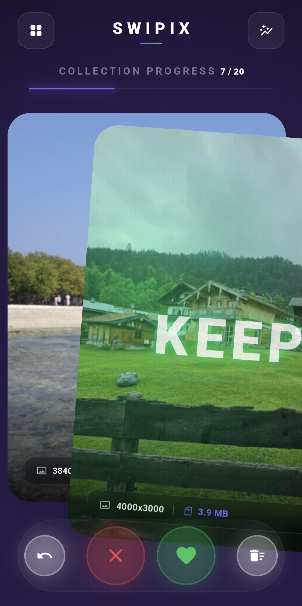
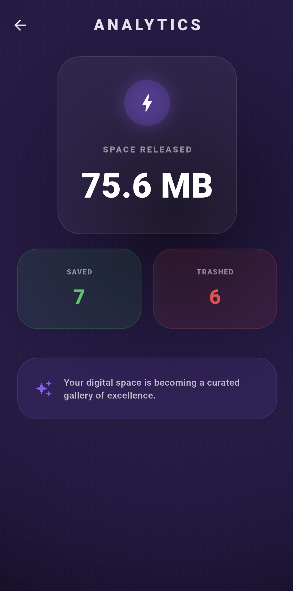

# 📸 Swipix - Tinder for your Messy Gallery


## 🤦 The "10,000 Photos" Crisis
We've all been there. You have 10,000 photos. 4,000 are blurry screenshots of memes you don't remember, 3,000 are "just in case" shots of your cat sleeping, and the rest is actually important stuff. 

I looked at my storage, saw "99% full," and felt a spiritual crisis. Instead of doing the rational thing (deleting them manually), I spent way too many hours building **Swipix**. Now my gallery is clean, and my ego as a developer is satisfied.

## ✨ What is this?
**Swipix** is a premium-feeling, high-performance photo cleaner for Android. It turns the boring "cleaning up" into a dopamine-fueled swiping session.

### 🚀 Features
- **Tinder-style UI:** Swipe **Right** to keep that masterpiece. Swipe **Left** to send that blurry receipt to the shadow.
- **Safety First (The "No Heart Attack" Policy):** Swiped left by mistake? Everything goes into a local app-specific trash folder first. You can undo your mistakes like they never happened.
- **Privacy Zero-Snitch:** No internet permission. No tracking. No "sending your data to the cloud." Your embarrassing selfies stay on your phone.
- **Detailed Stats:** See exactly how much storage you've reclaimed from the digital void.
- **Album Support:** Clean your "WhatsApp Images" or "Screenshots" folder specifically.

## 🛠 How it Works
| Action | Result |
| :--- | :--- |
| **Swipe Right** ❤️ | The app remembers you like this photo. It won't show it to you again. |
| **Swipe Left** 🗑️ | The file is moved to a hidden `.swipix_trash` folder. It disappears from your main gallery immediately. |
| **Undo** ↩️ | Instantly brings the last photo back from the trash or registry. |
| **Purge** 🔥 | Empty the trash folder permanently and feel the weight of 5GB leaving your soul. |

---

## 📸 Screenshots
<p align="left">
  
  
  
</p>

---

## 📲 How to Install
If you want to run this on your own device:

1. **Clone the repo:**
   ```bash
   git clone https://github.com/yourusername/swipix.git
   ```
2. **Install dependencies:**
   ```bash
   flutter pub get
   ```
3. **Build the APK:**
   ```bash
   flutter build apk --release
   ```
4. **Install on Phone:**
   Drag and drop the APK to your phone or use `adb install`.

*Note: Since this app handles your files, it will ask for "All Files Access" (Android 11+). This is necessary to move files to the trash folder without asking you for permission 5,000 times.*

## ⚖️ License
MIT. Do whatever you want, just don't blame me if you swipe left on your wedding photos. Use the Undo button!

---
*Built with ❤️ and a desperate need for more disk space.*
